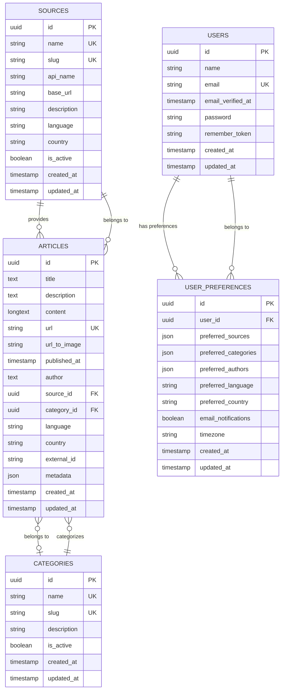

# News Aggregator - Laravel Backend

A comprehensive, intelligent news aggregation system built with Laravel that collects, processes, and serves news articles from multiple APIs. Features advanced scraping capabilities, real-time search, user personalization, and robust security measures.

## 🚀 Key Features

### 1. **Intelligent News Scraping System**
- **Auto-Scraping for New Users**: Automatically scrapes news when users register and no articles exist
- **Preference-Based Scraping**: Scrapes news based on user preferences with fallback to default categories
- **Real-Time Search Scraping**: Live scraping when users search for specific topics
- **Smart Duplicate Prevention**: Prevents duplicate articles using URL and external ID matching
- **Background Processing**: Heavy operations processed asynchronously using Laravel queues

### 2. **Security & Abuse Prevention**
- **Multi-Level Rate Limiting**: 30/min, 300/hour, 1000/day per user/IP
- **Suspicious Pattern Detection**: Identifies and blocks unusual request patterns
- **Input Sanitization**: Comprehensive validation and sanitization of all parameters
- **Request Frequency Control**: Minimum 2-second intervals between requests

### 3. **Performance Optimization**
- **Smart Caching Strategy**: Redis-based caching with different TTLs for different data types
- **Database Optimization**: Full-text search, optimized indexes, and efficient queries with unlimited text fields
- **Queue Management**: Background job processing with retry mechanisms
- **Result Merging**: Intelligent combination of existing and new articles

### 4. **Core Functionality**
- **Multi-API Integration**: NewsAPI, NewsData.io, and New York Times APIs
- **User Authentication**: Laravel Sanctum with personalized preferences
- **Advanced Search & Filtering**: Full-text search with date, category, and source filters
- **RESTful API**: Clean, documented endpoints for frontend consumption
- **PostgreSQL Database**: Robust data storage with UUID primary keys and optimized field types

### 5. **Recent Improvements & Fixes** ✅
- **Database Field Optimization**: Fixed text truncation issues with unlimited field lengths
- **Enhanced Error Handling**: Comprehensive error logging and graceful fallbacks
- **Schema Validation**: Proactive database health checks with `db:validate-schema`
- **Improved Seeding**: Better conflict resolution and duplicate prevention
- **Authentication Clarity**: Clear error messages for protected endpoints

## 🏗️ Tech Stack

- **Backend**: Laravel 10 (PHP 8.1)
- **Database**: PostgreSQL 15 with full-text search
- **Cache**: Redis for session, queue, and caching
- **Queue**: Laravel Queue with Redis driver
- **Containerization**: Docker & Docker Compose
- **Web Server**: Nginx
- **Process Manager**: Supervisor

## 📊 Database Schema (ERD)

The database follows a clean, normalized structure with UUID primary keys:



### Key Database Features:
- **UUID Primary Keys**: All tables use UUID for better security and distribution
- **Optimized Field Types**: Text fields for titles and authors to handle unlimited content length
- **Full-Text Search**: Articles table has full-text indexes on title, description, and content
- **Optimized Indexes**: Strategic indexes on published_at, source_id, and category_id
- **JSON Fields**: Flexible metadata storage and user preferences
- **Foreign Key Constraints**: Ensures data integrity across relationships

## 📁 Project Structure

```
backend/
├── app/
│   ├── Console/Commands/          # Artisan commands
│   │   ├── ScrapeNewsCommand.php  # Original scraping command
│   │   └── ScrapeNewsForUserCommand.php  # New intelligent scraping
│   ├── Http/
│   │   ├── Controllers/Api/       # API Controllers
│   │   │   ├── ArticleController.php      # Article management with auto-scraping
│   │   │   ├── AuthController.php         # Authentication
│   │   │   ├── CategoryController.php     # Categories
│   │   │   ├── SourceController.php       # News sources
│   │   │   └── UserPreferenceController.php  # User preferences with scraping
│   │   ├── Middleware/            # Custom middleware
│   │   │   └── NewsScrapingRateLimit.php  # Rate limiting & abuse prevention
│   │   └── Kernel.php             # HTTP kernel with middleware registration
│   ├── Jobs/                      # Background jobs
│   │   └── ScrapeNewsJob.php      # Asynchronous news scraping
│   ├── Models/                    # Eloquent models
│   │   ├── Article.php            # Articles with search scopes
│   │   ├── Category.php           # News categories
│   │   ├── Source.php             # News sources
│   │   ├── User.php               # Users
│   │   └── UserPreference.php     # User preferences
│   ├── Services/                  # Business logic services
│   │   ├── NewsScrapingService.php    # Main intelligent scraping service
│   │   └── NewsAPIs/              # External API integrations
│   │       ├── NewsAPIService.php     # NewsAPI.org integration
│   │       ├── NewsDataService.php    # NewsData.io integration
│   │       └── NYTimesService.php     # New York Times API
│   └── Traits/
│       └── HasUuid.php            # UUID trait for models
├── config/                        # Configuration files
├── database/
│   ├── migrations/                # Database migrations
│   └── seeders/                   # Database seeders
├── routes/
│   └── api.php                    # API routes with middleware
├── storage/logs/                  # Application logs
├── docker-compose.yml             # Docker services configuration
├── Dockerfile                     # Docker image definition
└── NEWS_SCRAPING_SYSTEM.md        # Detailed scraping system docs
```

## 🚀 Quick Start with Docker

### Prerequisites

- Docker Desktop
- Docker Compose

### Environment Setup

1. **Clone the repository**
   ```bash
   git clone <repository-url>
   cd innoscripta/backend
   ```

2. **Environment Configuration**
   ```bash
   # Copy environment template
   cp .env.example .env
   ```
   
   **Edit the `.env` file with your credentials:**
   ```env
   # Application
   APP_NAME="News Aggregator"
   APP_ENV=local
   APP_DEBUG=true
   APP_URL=http://localhost:8000
   
   # Database (Docker defaults - no changes needed)
   DB_CONNECTION=pgsql
   DB_HOST=db
   DB_PORT=5432
   DB_DATABASE=news_aggregator
   DB_USERNAME=postgres
   DB_PASSWORD=password
   
   # Cache & Queue (Docker defaults - no changes needed)
   CACHE_DRIVER=redis
   QUEUE_CONNECTION=redis
   SESSION_DRIVER=redis
   REDIS_HOST=redis
   REDIS_PORT=6379
   
   # News API Keys (REQUIRED - Get from respective providers)
   NEWSAPI_KEY=your_newsapi_key_here
   NEWSDATA_API_KEY=your_newsdata_key_here
   NYT_API_KEY=your_nyt_api_key_here
   
   # SMTP Email Configuration (REQUIRED for user registration)
   MAIL_MAILER=smtp
   MAIL_HOST=smtp.gmail.com
   MAIL_PORT=587
   MAIL_USERNAME=your_email@gmail.com
   MAIL_PASSWORD="your_app_password_here"
   MAIL_ENCRYPTION=tls
   MAIL_FROM_ADDRESS="your_email@gmail.com"
   MAIL_FROM_NAME="News Aggregator"
   ```

### Installation & Startup

3. **Start Everything (Recommended)**
   ```bash
   # Easy way - handles everything automatically
   ./start.sh
   ```
   
   **OR Manual Setup:**
   ```bash
   # Build and start services
   docker compose up -d --build

   # Generate application key
   docker exec -it news_aggregator_backend php artisan key:generate
   
   # Run migrations (creates database tables)
   docker exec -it news_aggregator_backend php artisan migrate --force

   # Seed sources and categories
   docker exec -it news_aggregator_backend php artisan news:seed-sources
   
   # Start queue worker for background jobs
   docker exec -d news_aggregator_backend php artisan queue:work
   ```

4. **Initialize with Default News**
   ```bash
   # Scrape initial news articles
   docker exec -it news_aggregator_backend php artisan news:scrape-user --default
    
   # OR use the original command
   docker exec -it news_aggregator_backend php artisan news:scrape --limit=100
   ```

5. **Test the System**
   ```bash
   # Test email configuration
   docker exec -it news_aggregator_backend php artisan email:test
   
   # Test intelligent scraping system
   docker exec -it news_aggregator_backend php artisan news:scrape-user --default --queue
   ```

### Access the Application

- **Backend API**: http://localhost:8000
- **Interactive API Docs**: http://localhost:8000/docs
- **Database**: localhost:5432 (postgres/password)
- **Redis**: localhost:6380 (to avoid conflicts with system Redis)

## 🛠️ Development Commands

### Quick Start Scripts
```bash
# Start all services (builds, migrates, seeds data)
./start.sh

# Stop all services
./stop.sh

# Generate API documentation
./generate-docs.sh

# Configure API keys (interactive helper)
./configure-api-keys.sh

# Validate database schema (NEW)
docker compose exec backend php artisan db:validate-schema

# Reset sources if needed (NEW)
docker compose exec backend php artisan sources:reset

# Check status
docker compose ps

# View logs
docker compose logs -f backend
```

### News Scraping Commands
```bash
# Intelligent scraping commands (NEW)
docker exec -it news_aggregator_backend php artisan news:scrape-user --default
docker exec -it news_aggregator_backend php artisan news:scrape-user --user-id=<uuid>
docker exec -it news_aggregator_backend php artisan news:scrape-user --email=user@example.com
docker exec -it news_aggregator_backend php artisan news:scrape-user --default --queue
docker exec -it news_aggregator_backend php artisan news:scrape-user --user-id=<uuid> --force

# Original scraping commands
docker exec -it news_aggregator_backend php artisan news:scrape --limit=100
docker exec -it news_aggregator_backend php artisan news:scrape --source=newsapi
docker exec -it news_aggregator_backend php artisan news:scrape --source=newsdata
docker exec -it news_aggregator_backend php artisan news:scrape --source=nyt
```

### Queue Management
```bash
# Start queue worker
docker exec -d news_aggregator_backend php artisan queue:work

# Monitor queue in real-time
docker exec -it news_aggregator_backend php artisan queue:work --verbose

# Check failed jobs
docker exec -it news_aggregator_backend php artisan queue:failed

# Retry failed jobs
docker exec -it news_aggregator_backend php artisan queue:retry all

# Clear all jobs
docker exec -it news_aggregator_backend php artisan queue:clear
```

### Database Management
```bash
# Run migrations
docker exec -it news_aggregator_backend php artisan migrate

# Migration status
docker exec -it news_aggregator_backend php artisan migrate:status

# Rollback migrations
docker exec -it news_aggregator_backend php artisan migrate:rollback

# Fresh migration with seeding
docker exec -it news_aggregator_backend php artisan migrate:fresh --seed

# Seed sources and categories
docker exec -it news_aggregator_backend php artisan news:seed-sources

# Validate database schema (NEW)
docker exec -it news_aggregator_backend php artisan db:validate-schema

# Reset and reseed sources (fixes duplicate key issues)
docker exec -it news_aggregator_backend php artisan sources:reset
```

## 🐛 Debugging & Troubleshooting

### Logging & Monitoring
```bash
# View real-time application logs
docker exec -it news_aggregator_backend tail -f storage/logs/laravel.log

# Search for errors in logs
docker exec -it news_aggregator_backend grep -A 10 -B 10 "ERROR\|Exception\|Fatal" storage/logs/laravel.log | tail -30

# View specific error types
docker exec -it news_aggregator_backend grep "NewsScrapingService" storage/logs/laravel.log
docker exec -it news_aggregator_backend grep "Rate limit" storage/logs/laravel.log
docker exec -it news_aggregator_backend grep "Scraping" storage/logs/laravel.log

# Docker container logs
docker compose logs -f backend
docker compose logs backend | grep ERROR
```

### System Health Checks
```bash
# Test database connection
docker exec -it news_aggregator_backend php artisan tinker --execute="use Illuminate\Support\Facades\DB; DB::select('SELECT 1')"

# Test Redis connection
docker exec -it news_aggregator_backend php artisan tinker --execute="use Illuminate\Support\Facades\Cache; Cache::put('test', 'Redis is working!', 60); echo Cache::get('test');"

# Check service status
docker compose ps
docker compose exec backend ps aux

# Test API endpoints
curl -X GET "http://localhost:8000/api/articles" -H "Accept: application/json"
curl -X GET "http://localhost:8000/api/categories" -H "Accept: application/json"
```

### Performance Monitoring
```bash
# Monitor queue performance
docker exec -it news_aggregator_backend php artisan queue:monitor --max-jobs=1000

# Check cache statistics
docker exec -it news_aggregator_backend php artisan tinker --execute="use Illuminate\Support\Facades\Cache; print_r(Cache::getRedis()->info());"

# Database query monitoring
docker exec -it news_aggregator_backend php artisan tinker --execute="use Illuminate\Support\Facades\DB; DB::enableQueryLog(); App\Models\Article::count(); print_r(DB::getQueryLog());"
```

### Common Issues & Solutions

#### 1. **No Articles After Registration**
```bash
# Check if scraping is working
docker exec -it news_aggregator_backend php artisan news:scrape-user --default

# Check queue worker status
docker exec -it news_aggregator_backend php artisan queue:work --once

# Manually trigger scraping
docker exec -it news_aggregator_backend php artisan news:scrape --limit=50
```

#### 2. **Rate Limiting Issues**
```bash
# Check rate limit logs
docker exec -it news_aggregator_backend grep "Rate limit" storage/logs/laravel.log

# Clear rate limit cache
docker exec -it news_aggregator_backend php artisan cache:clear

# Check current cache keys
docker exec -it news_aggregator_backend php artisan tinker --execute="use Illuminate\Support\Facades\Cache; print_r(Cache::getRedis()->keys('*rate_limit*'));"
```

#### 3. **Database Connection Issues**
```bash
# Check database container
docker compose ps db

# Test database connectivity
docker exec -it news_aggregator_db psql -U postgres -d news_aggregator -c "SELECT count(*) FROM articles;"

# Reset database
docker exec -it news_aggregator_backend php artisan migrate:fresh --seed
```

#### 4. **Queue Problems**
```bash
# Check failed jobs
docker exec -it news_aggregator_backend php artisan queue:failed

# Restart queue worker
docker compose restart backend
docker exec -d news_aggregator_backend php artisan queue:work

# Clear and restart
docker exec -it news_aggregator_backend php artisan queue:clear
docker exec -it news_aggregator_backend php artisan queue:restart
```

#### 5. **Duplicate Key Violations (Sources Seeding)**
```bash
# Reset and reseed sources table
docker compose exec backend php artisan sources:reset

# Or reset entire database
docker compose exec backend php artisan migrate:fresh --seed

# Check existing sources
docker compose exec backend php artisan tinker --execute="App\Models\Source::all(['name', 'slug', 'api_name'])->each(function(\$s) { echo \$s->name . ' - ' . \$s->slug . PHP_EOL; });"
```

#### 6. **Seeding Process Issues (NEW)**
```bash
# Check if sources already exist
docker compose exec backend php artisan tinker --execute="echo 'Sources count: ' . App\Models\Source::count();"

# Validate database schema before seeding
docker compose exec backend php artisan db:validate-schema

# Force fresh seeding (WARNING: This will clear all data)
docker compose exec backend php artisan migrate:fresh --seed

# Check seeding status
docker compose exec backend php artisan db:seed --force
```

#### 7. **API Service Configuration Issues**
```bash
# Check if API services are configured
docker compose exec backend php artisan tinker --execute="echo 'NewsAPI: ' . (app('App\Services\NewsAPIs\NewsAPIService')->isConfigured() ? 'Yes' : 'No') . PHP_EOL; echo 'NewsData: ' . (app('App\Services\NewsAPIs\NewsDataService')->isConfigured() ? 'Yes' : 'No') . PHP_EOL; echo 'NYT: ' . (app('App\Services\NewsAPIs\NYTimesService')->isConfigured() ? 'Yes' : 'No') . PHP_EOL;"

# Configure API keys interactively
./configure-api-keys.sh

# Test individual API services
docker compose exec backend php artisan news:scrape-user --default
```

#### 8. **Database Schema Issues (NEW)**
```bash
# Validate database schema for potential issues
docker compose exec backend php artisan db:validate-schema

# Check for field length issues
docker compose exec backend php artisan tinker --execute="DB::select('SELECT column_name, data_type, character_maximum_length FROM information_schema.columns WHERE table_name = \'articles\' AND column_name IN (\'title\', \'author\')');"

# Fix field length issues (if needed)
docker compose exec backend php artisan migrate
```

#### 9. **API Response Issues**
```bash
# Test with verbose output
curl -v -X GET "http://localhost:8000/api/articles/search?q=technology" -H "Accept: application/json"

# Check middleware
docker exec -it news_aggregator_backend php artisan route:list | grep articles

# Test authentication
curl -X POST "http://localhost:8000/api/login" -H "Content-Type: application/json" -d '{"email":"test@example.com","password":"password"}'
```

## 🔧 Recent Fixes & Improvements

### Database Field Length Issues (FIXED ✅)
- **Problem**: Article titles and author names were truncated due to 255 character limits
- **Solution**: Migrated `title` and `author` fields from `varchar(255)` to `text` type
- **Migration**: `2025_08_22_000000_fix_articles_table_field_lengths.php`
- **Result**: No more "String data, right truncated" errors

### Enhanced Error Handling (IMPROVED ✅)
- **Problem**: 500 errors without proper error messages or logging
- **Solution**: Added comprehensive try-catch blocks with detailed logging
- **Result**: Better debugging information and graceful error handling

### Database Schema Validation (NEW ✅)
- **New Command**: `php artisan db:validate-schema`
- **Purpose**: Proactively identify database issues before they cause runtime errors
- **Features**: Checks field lengths, duplicate keys, and data integrity

### Sources Seeding Improvements (FIXED ✅)
- **Problem**: Duplicate key violations during seeding
- **Solution**: Enhanced seeder with better conflict resolution and duplicate prevention
- **New Command**: `php artisan sources:reset` for clean slate seeding
- **Prevention**: Seeder now checks if sources exist before attempting to seed
- **Transaction Safety**: Uses database transactions for better data integrity

### API Authentication Clarity (IMPROVED ✅)
- **Problem**: Unclear authentication requirements for protected endpoints
- **Solution**: Better error messages and documentation
- **Result**: Clear 401 responses instead of confusing 500 errors

### Cache Management
```bash
# Clear all caches
docker exec -it news_aggregator_backend php artisan cache:clear
docker exec -it news_aggregator_backend php artisan config:clear
docker exec -it news_aggregator_backend php artisan route:clear

# View cache keys
docker exec -it news_aggregator_backend php artisan tinker --execute="use Illuminate\Support\Facades\Cache; print_r(Cache::getRedis()->keys('*'));"

# Clear specific cache patterns
docker exec -it news_aggregator_backend php artisan tinker --execute="use Illuminate\Support\Facades\Cache; Cache::getRedis()->del(Cache::getRedis()->keys('search_*'));"
```

## 📡 API Endpoints

### Authentication
```http
POST /api/register              # User registration with auto-scraping
POST /api/login                 # User login
POST /api/logout                # User logout
GET  /api/user                  # Get authenticated user
```

### Articles (Enhanced with Intelligent Scraping)
```http
GET  /api/articles              # List articles with auto-scraping if empty
GET  /api/articles/{id}         # Get specific article
GET  /api/articles/search       # Search with live scraping (NEW)
```

### Categories & Sources
```http
GET  /api/categories            # List all categories
GET  /api/sources               # List all sources
```

### User Preferences (Enhanced)
```http
GET  /api/preferences           # Get user preferences
POST /api/preferences           # Update preferences (triggers scraping)
GET  /api/personalized-feed     # Personalized feed with auto-scraping
```

### Security Features
- **Rate Limiting**: 30/min, 300/hour, 1000/day per user/IP
- **Suspicious Pattern Detection**: Automatic blocking of abuse
- **Input Validation**: Comprehensive parameter sanitization
- **Background Processing**: Non-blocking scraping operations

## ⚙️ Manual Setup (Without Docker)

### Requirements

- PHP 8.1+
- Composer
- PostgreSQL 15+
- Redis (recommended for caching and queues)

### Installation Steps

1. **Install Dependencies**
   ```bash
   composer install
   ```

2. **Environment Configuration**
   ```bash
   cp .env.example .env
   php artisan key:generate
   ```

3. **Configure Database**
   Update `.env` file:
   ```env
   DB_CONNECTION=pgsql
   DB_HOST=127.0.0.1
   DB_PORT=5432
   DB_DATABASE=news_aggregator
   DB_USERNAME=postgres
   DB_PASSWORD=password
   
   # Queue & Cache
   QUEUE_CONNECTION=redis
   CACHE_DRIVER=redis
   SESSION_DRIVER=redis
   REDIS_HOST=127.0.0.1
   REDIS_PORT=6379
   ```

4. **Add API Keys and SMTP Configuration**
   Edit the `.env` file and add your credentials:
   ```env
   # News API Keys (REQUIRED)
   NEWSAPI_KEY=your_newsapi_key_here
   NEWSDATA_API_KEY=your_newsdata_key_here
   NYT_API_KEY=your_nyt_api_key_here
   
   # SMTP Email Configuration (REQUIRED)
   MAIL_MAILER=smtp
   MAIL_HOST=smtp.gmail.com
   MAIL_PORT=587
   MAIL_USERNAME=your_email@gmail.com
   MAIL_PASSWORD="your_app_password_here"
   MAIL_ENCRYPTION=tls
   MAIL_FROM_ADDRESS="your_email@gmail.com"
   MAIL_FROM_NAME="News Aggregator"
   ```

5. **Setup Database and Queue**
   ```bash
   # Create queue tables
   php artisan queue:table
   
   # Run migrations
   php artisan migrate
   
   # Seed sources and categories
   php artisan news:seed-sources
   ```

6. **Start Services**
   ```bash
   # Start the application
   php artisan serve
   
   # In separate terminal - start queue worker
   php artisan queue:work
   
   # Optional: Start scheduler
   php artisan schedule:work
   ```

## 📋 Available Commands

### Intelligent News Scraping (NEW)
```bash
# Scrape for specific user
php artisan news:scrape-user --user-id=<uuid>
php artisan news:scrape-user --email=user@example.com

# Scrape default news for all users
php artisan news:scrape-user --default

# Use background queue processing
php artisan news:scrape-user --default --queue
php artisan news:scrape-user --user-id=<uuid> --queue

# Force refresh (ignore cache)
php artisan news:scrape-user --user-id=<uuid> --force
```

### Traditional News Management
```bash
# Seed initial sources and categories
php artisan news:seed-sources

# Reset and reseed sources (fixes duplicate key issues)
php artisan sources:reset

# Original scraping commands
php artisan news:scrape --limit=100
php artisan news:scrape --source=newsapi
php artisan news:scrape --source=newsdata
php artisan news:scrape --source=nyt

# Clean up old articles
php artisan news:cleanup --days=30

# Start Laravel scheduler (for automated scraping)
php artisan schedule:work
```

### Queue Management
```bash
# Start queue worker
php artisan queue:work

# Monitor queue performance
php artisan queue:monitor --max-jobs=1000

# Check failed jobs
php artisan queue:failed

# Retry failed jobs
php artisan queue:retry all

# Clear all jobs
php artisan queue:clear

# Restart queue workers
php artisan queue:restart
```

### Email Management
```bash
# Test email configuration (simple)
php artisan email:test

# Test welcome email template
php artisan email:test --type=welcome

# Test with custom recipient
php artisan email:test --to=your-email@example.com --type=welcome
```

### Production Commands
```bash
# Install production dependencies
composer install --no-dev --optimize-autoloader

# Run migrations
php artisan migrate --force

# Optimize for production
php artisan config:cache
php artisan route:cache
php artisan view:cache

# Generate API documentation
php artisan scribe:generate --force
```

## 🔧 Configuration

### Environment Variables

The application uses a comprehensive `.env` file for configuration:

```env
# Application Settings
APP_NAME="News Aggregator"
APP_ENV=local
APP_DEBUG=true
APP_URL=http://localhost:8000
APP_KEY=base64:your_generated_key_here

# Database Configuration
DB_CONNECTION=pgsql
DB_HOST=db                    # 'db' for Docker, '127.0.0.1' for local
DB_PORT=5432
DB_DATABASE=news_aggregator
DB_USERNAME=postgres
DB_PASSWORD=password

# Cache & Queue Configuration
CACHE_DRIVER=redis
QUEUE_CONNECTION=redis
SESSION_DRIVER=redis
REDIS_HOST=redis             # 'redis' for Docker, '127.0.0.1' for local
REDIS_PORT=6379

# News API Keys (REQUIRED)
NEWSAPI_KEY=your_newsapi_key
NEWSDATA_API_KEY=your_newsdata_key
NYT_API_KEY=your_nyt_key

# Email Configuration (REQUIRED)
MAIL_MAILER=smtp
MAIL_HOST=smtp.gmail.com
MAIL_PORT=587
MAIL_USERNAME=your_email@gmail.com
MAIL_PASSWORD="your_app_password"
MAIL_ENCRYPTION=tls
MAIL_FROM_ADDRESS="your_email@gmail.com"
MAIL_FROM_NAME="News Aggregator"

# Docker Ports
APP_PORT=8000                # External port for the application
REDIS_EXTERNAL_PORT=6380     # External port for Redis
```

### Security Configuration

The intelligent scraping system includes configurable security settings:

```env
# Rate Limiting (requests per timeframe)
NEWS_SCRAPING_RATE_LIMIT_MINUTE=30
NEWS_SCRAPING_RATE_LIMIT_HOUR=300
NEWS_SCRAPING_RATE_LIMIT_DAY=1000

# Abuse Prevention
NEWS_SCRAPING_MAX_DATE_RANGE_DAYS=30
NEWS_SCRAPING_MAX_CATEGORIES_PER_REQUEST=5
NEWS_SCRAPING_MIN_REQUEST_INTERVAL_SECONDS=2
```

## ⏰ Automated Tasks

### Intelligent Scraping Schedule

The system automatically handles news scraping through multiple triggers:

1. **User Registration**: Auto-scrapes news when new users register
2. **Empty Database**: Triggers background scraping when no articles exist
3. **Search Queries**: Live scraping for search requests
4. **User Preferences**: Scraping when users update their preferences

### Traditional Scheduled Tasks

- **Hourly**: Background news scraping from all APIs (queue-based)
- **Daily**: Cleanup of articles older than 30 days
- **Queue Processing**: Continuous background job processing

### Manual Scheduling

```bash
# Start the Laravel scheduler
php artisan schedule:work

# Or add to crontab for production
* * * * * cd /path-to-your-project && php artisan schedule:run >> /dev/null 2>&1
```

## 🏗️ Architecture & Development

### Intelligent Scraping Architecture

The system implements a sophisticated, multi-layered architecture:

```
┌─────────────────┐    ┌──────────────────┐    ┌─────────────────┐
│   User Request  │───▶│  Rate Limiting   │───▶│  Cache Check    │
└─────────────────┘    └──────────────────┘    └─────────────────┘
                                                         │
┌─────────────────┐    ┌──────────────────┐    ┌─────────────────┐
│ Background Jobs │◀───│ Scraping Service │◀───│ Database Query  │
└─────────────────┘    └──────────────────┘    └─────────────────┘
         │                       │                       │
         ▼                       ▼                       ▼
┌─────────────────┐    ┌──────────────────┐    ┌─────────────────┐
│   Redis Queue   │    │   External APIs  │    │   PostgreSQL    │
└─────────────────┘    └──────────────────┘    └─────────────────┘
```

### Service Layer

- **NewsScrapingService**: Main orchestration service with intelligent scraping logic
- **NewsAPIService**: NewsAPI.org integration with enhanced search capabilities
- **NewsDataService**: NewsData.io integration
- **NYTimesService**: New York Times API with robust error handling
- **ScrapeNewsJob**: Background job processing with retry mechanisms

### Code Quality & Standards

- **SOLID Principles**: Clear separation of concerns with dependency injection
- **PSR Standards**: Following PSR-4 autoloading and PSR-12 coding standards
- **Laravel Best Practices**: Service providers, facades, and Eloquent relationships
- **Security First**: Input validation, rate limiting, and abuse prevention
- **Performance Optimized**: Caching strategies and efficient database queries

### Testing

```bash
# Run the test suite
php artisan test

# Run with coverage report
php artisan test --coverage

# Run specific test classes
php artisan test --filter=NewsScrapingServiceTest
```

## 🔒 Security Features

### Multi-Layer Protection

1. **Rate Limiting**: Prevents API abuse with configurable thresholds
2. **Input Sanitization**: Comprehensive validation of all user inputs
3. **Suspicious Pattern Detection**: AI-like detection of unusual request patterns
4. **Background Processing**: Heavy operations isolated from user requests
5. **Cache-based Security**: Intelligent caching prevents repetitive abuse

### Environment Security

**CRITICAL SECURITY PRACTICES:**

- ✅ Use `.env.example` as template, never commit `.env`
- ✅ Rotate API keys monthly for production systems
- ✅ Use Gmail App Passwords (not account passwords) for SMTP
- ✅ Enable 2FA on all external API accounts
- ❌ Never commit real credentials to version control
- ❌ Never expose API keys in frontend code

## 📚 API Documentation

**Comprehensive Interactive Documentation Available:**

- **📖 Interactive Docs**: http://localhost:8000/docs
- **📋 OpenAPI Spec**: http://localhost:8000/docs/openapi.yaml  
- **📫 Postman Collection**: http://localhost:8000/docs/collection.json

### Documentation Features:
- ✅ **Live Testing**: "Try It Out" buttons for all endpoints
- ✅ **Authentication Guide**: Complete auth flow documentation
- ✅ **Rate Limiting Info**: Security and abuse prevention details
- ✅ **Response Examples**: Real response samples for all endpoints
- ✅ **Error Handling**: Comprehensive error response documentation

### Regenerate Documentation

```bash
# Update API documentation
docker exec -it news_aggregator_backend php artisan scribe:generate --force

# Or using script
./generate-docs.sh
```

## 🚨 Important Notes

### API Rate Limits (External Services)
- **NewsAPI**: 1000 requests/day (free tier)
- **NewsData.io**: 200 requests/day (free tier)  
- **NY Times**: 1000 requests/day (free tier)

### System Rate Limits (Internal Protection)
- **Per User**: 30/min, 300/hour, 1000/day
- **Suspicious Activity**: Automatic temporary blocking
- **Background Processing**: No limits on internal operations

## 🤝 Contributing

1. Fork the repository
2. Create a feature branch: `