# 🚀 News Aggregator Frontend

A modern, responsive React-based frontend for the News Aggregator application with intelligent news scraping, real-time job monitoring, and personalized user experiences.

## 📋 Table of Contents

- [🚀 Quick Start](#-quick-start)
- [🏗️ Project Structure](#️-project-structure)
- [📱 Pages & Components](#-pages--components)
- [🔄 Workflows & Logic](#-workflows--logic)
- [🛠️ Development](#️-development)
- [🚀 Deployment](#-deployment)
- [📚 API Integration](#-api-integration)

## 🚀 Quick Start

### Prerequisites

- **Node.js**: 18.x or higher
- **Package Manager**: pnpm (recommended) or npm
- **Backend**: Ensure the Laravel backend is running on `http://localhost:8000`

### Installation & Setup

```bash
# Clone the repository
git clone <repository-url>
cd innoscripta/frontend

# Install dependencies
pnpm install

# Set up environment variables
cp .env.example .env.local
# Edit .env.local with your backend URL

# Start development server
pnpm dev
```

### Environment Variables

```bash
# .env.local
VITE_API_BASE_URL=http://localhost:8000/api
VITE_APP_NAME="News Aggregator"
```

### Available Scripts

```bash
pnpm dev          # Start development server
pnpm build        # Build for production
pnpm preview      # Preview production build
pnpm lint         # Run ESLint
pnpm lint:fix     # Fix ESLint issues
pnpm type-check   # Run TypeScript type checking
pnpm format       # Format code with Prettier
```

## 🏗️ Project Structure

```
frontend/
├── src/
│   ├── components/          # Reusable UI components
│   │   ├── auth/           # Authentication components
│   │   ├── layout/         # Layout and navigation
│   │   ├── news/           # News-related components
│   │   ├── ui/             # Generic UI components
│   │   └── route-guard/    # Route protection
│   ├── pages/              # Main application pages
│   ├── hooks/              # Custom React hooks
│   ├── contexts/           # React contexts (Auth, etc.)
│   ├── store/              # Redux store and RTK Query
│   ├── types/              # TypeScript type definitions
│   ├── utils/              # Utility functions
│   ├── constants/          # Application constants
│   ├── theme/              # Material-UI theme configuration
│   └── styles/             # Global styles and CSS
├── public/                  # Static assets
├── dist/                    # Build output
└── docker-compose.yml       # Docker configuration
```

### Key Technologies

- **React 18.2.0** with TypeScript 5.2.2
- **Material-UI (MUI) v5.15.15** for UI components
- **Redux Toolkit v2.2.3** with RTK Query for state management
- **React Router v6.22.3** for navigation
- **Vite v5.2.0** for build tooling
- **ESLint v8.57.0 + Prettier v3.2.5** for code quality
- **React Hook Form v7.51.3** with Yup v1.4.0 for form handling
- **Axios v1.6.8** for HTTP requests
- **date-fns v3.6.0** for date manipulation

## 📱 Pages & Components

### Core Pages

#### 🏠 **HomePage** (`/`)

- **Purpose**: Landing page with featured articles and quick access
- **Features**:
  - Personalized news feed
  - Quick search functionality
  - Category navigation
  - Recent articles display

#### 🔍 **SearchPage** (`/news/search`)

- **Purpose**: Advanced news search with filtering and scraping
- **Features**:
  - Multi-criteria search (keyword, category, source, date range)
  - Real-time search results
  - News scraping confirmation modal
  - Credit system integration
  - Job creation for filtered scraping

#### 📰 **ArticlePage** (`/news/:id`)

- **Purpose**: Detailed article view with related content
- **Features**:
  - Full article content
  - Related articles
  - Social sharing
  - Reading preferences

#### 👤 **ProfilePage** (`/profile`)

- **Purpose**: User profile management and preferences
- **Features**:
  - Personal information
  - News preferences
  - Credit management
  - Reading history

#### 📊 **JobsPage** (`/jobs`)

- **Purpose**: Job monitoring and management
- **Features**:
  - Queue job status
  - Job cancellation/retry
  - Real-time updates
  - Queue synchronization

### Key Components

#### 🔐 **Authentication**

- `LoginForm`: User login with validation
- `RegisterForm`: User registration
- `AuthGuard`: Route protection
- `AuthContext`: Authentication state management

#### 📰 **News Components**

- `ArticleCard`: Article preview cards
- `ArticleList`: Paginated article lists
- `SearchFilters`: Advanced search interface
- `ScrapingConfirmationModal`: Job creation confirmation

#### 📊 **Job Monitoring**

- `JobMonitoringDrawer`: Quick job status overview
- `JobTable`: Detailed job information
- `QueueControls`: Job management actions

#### 🎨 **UI Components**

- `Layout`: Main application layout
- `Navigation`: Top navigation bar
- `LoadingSpinner`: Loading states
- `ErrorBoundary`: Error handling

## 🔄 Workflows & Logic

### 🔍 **News Search Workflow**


**Key Logic**:

- **Filter Application**: Real-time filtering with debounced search
- **Scraping Decision**: Automatic detection when no results found
- **Job Creation**: Credit-based job creation via Laravel queue
- **Result Monitoring**: Real-time job status updates

### 📊 **Job Management Workflow**


**Key Logic**:

- **Queue Integration**: Direct integration with Laravel Redis queue
- **Status Tracking**: Real-time job status monitoring
- **Job Control**: Cancel, retry, and monitor operations
- **Auto-refresh**: Periodic status updates

### 🔐 **Authentication Workflow**

```mermaid
graph TD
    A[User visits protected route] --> B{Auth token exists?}
    B -->|No| C[Redirect to login]
    B -->|Yes| D[Validate token]
    D --> E{Token valid?}
    E -->|No| F[Clear token & redirect]
    E -->|Yes| G[Allow access]
    C --> H[Login form]
    H --> I[Submit credentials]
    I --> J[Receive token]
    J --> K[Store token]
    K --> L[Redirect to original route]
```



**Key Logic**:

- **Token Management**: JWT token storage and validation
- **Route Protection**: Automatic redirect for unauthenticated users
- **Session Persistence**: Token-based session management
- **Error Handling**: Graceful authentication failures

### 💳 **Credit System Workflow**


**Key Logic**:

- **Credit Validation**: Pre-job credit checking
- **Automatic Deduction**: Credit consumption on job creation
- **Reset Mechanism**: Daily credit refresh
- **User Feedback**: Clear credit status display

## 🛠️ Development

### Code Quality Tools

- **ESLint**: Code linting and best practices
- **Prettier**: Code formatting
- **TypeScript**: Type safety and IntelliSense
- **Husky**: Git hooks for pre-commit checks

### State Management

- **Redux Toolkit**: Centralized state management
- **RTK Query**: API data fetching and caching
- **Local Storage**: User preferences and authentication

### API Integration

- **Axios**: HTTP client for API calls
- **RTK Query**: Automatic caching and synchronization
- **Error Handling**: Comprehensive error management
- **Authentication**: Bearer token integration

### Performance Optimizations

- **Code Splitting**: Route-based lazy loading
- **Memoization**: React.memo and useMemo usage
- **Debouncing**: Search input optimization
- **Virtual Scrolling**: Large list performance

## 🚀 Deployment

### Docker Deployment

```bash
# Build and run with Docker
docker compose up --build

# Production build
docker build -t news-aggregator-frontend .
```

### Environment Configuration

```bash
# Production environment
VITE_API_BASE_URL=https://api.yourdomain.com
VITE_APP_NAME="News Aggregator"
NODE_ENV=production
```

### Build Optimization

```bash
# Production build
pnpm build

# Analyze bundle
pnpm build --analyze

# Preview build
pnpm preview
```

## 📚 API Integration

### Endpoints

- **Authentication**: `/api/login`, `/api/register`
- **Articles**: `/api/articles`, `/api/articles/search`
- **Queue Management**: `/api/queue/jobs`, `/api/queue/sync-status`
- **User Preferences**: `/api/preferences`

### Data Flow

1. **User Action** → Component dispatches action
2. **RTK Query** → API call with authentication
3. **Backend Processing** → Laravel handles request
4. **Response** → Data cached and component updated
5. **UI Update** → Component re-renders with new data

### Error Handling

- **Network Errors**: Automatic retry and fallback
- **Authentication Errors**: Automatic logout and redirect
- **Validation Errors**: User-friendly error messages
- **Server Errors**: Graceful degradation

## 🔧 Troubleshooting

### Common Issues

1. **Build Failures**: Check TypeScript errors and dependencies
2. **API Connection**: Verify backend URL and CORS settings
3. **Authentication**: Check token validity and storage
4. **Performance**: Monitor bundle size and lazy loading

### Debug Tools

- **React DevTools**: Component inspection
- **Redux DevTools**: State management debugging
- **Network Tab**: API call monitoring
- **Console Logs**: Application logging

---

## 📄 License

This project is part of the News Aggregator application. See the main repository for license information.

## 🤝 Contributing

1. Follow the established code style (ESLint + Prettier)
2. Write meaningful commit messages
3. Test your changes thoroughly
4. Update documentation as needed

---

**Happy coding! 🎉**
